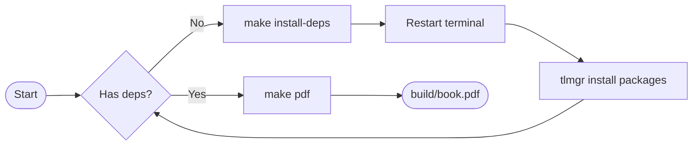
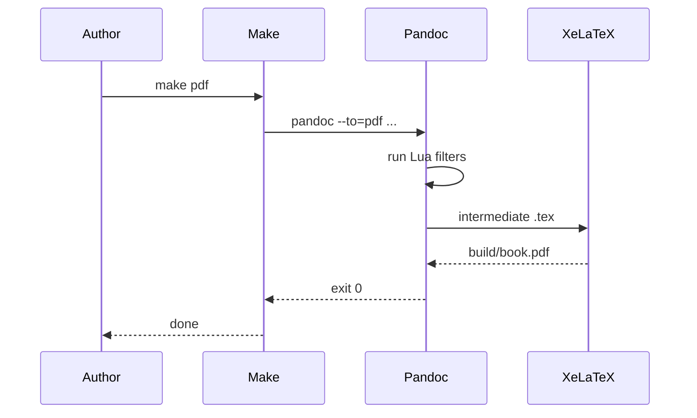
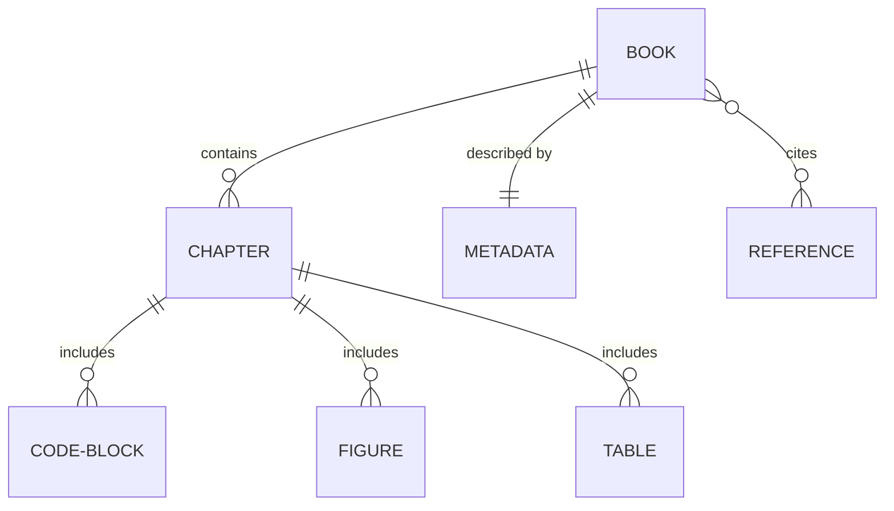

# Figures, Tables, and Diagrams {#sec:figures-tables-diagrams}

Visual elements — images, tables, and Mermaid diagrams — each have a designated workflow that keeps sources in plain text and renders correctly across PDF, EPUB, and HTML output.

## Figures

Place image files in `assets/images/`. Reference them with standard Markdown image syntax:

```markdown
{width=80%}
```

The `{width=80%}` attribute controls the display width. It translates to `\includegraphics[width=0.8\linewidth]` in the PDF and `width="80%"` in HTML. Common widths:

| Attribute | Use case |
|---|---|
| `{width=100%}` | Full-width screenshots, diagrams |
| `{width=80%}` | Most figures |
| `{width=50%}` | Small icons, narrow charts |

### File Formats

| Format | Best for |
|---|---|
| PNG | Screenshots, diagrams with text |
| SVG | Vector diagrams (HTML/EPUB only — XeLaTeX needs PDF or PNG) |
| PDF | Vector art in PDF output |
| JPEG | Photographs |

```{=latex}
\begin{tipbox}
For diagrams you draw yourself, export two versions: an SVG for the
HTML/EPUB targets and a PDF or high-resolution PNG for the PDF target.
Store both in \texttt{assets/images/} and switch between them using
a Lua filter or conditional raw blocks if needed.
\end{tipbox}
```

### Figure Labels

Add a label attribute to reference a figure in the text:

```markdown
{#fig:arch width=90%}
```

Then reference it with a Markdown link:

```markdown
As shown in [the architecture diagram](#fig:arch), the system has three layers.
```

## Tables

Tables use Pandoc's pipe syntax. The template applies automatic styling via a Lua filter: header rows receive a blue-gray background with bold sans-serif text, and even body rows receive a subtle alternating tint.

```markdown
| Stage | Input | Output |
|---|---|---|
| Parse | Markdown source | Pandoc AST |
| Filter | Pandoc AST | Modified AST |
| Render | Modified AST | LaTeX / HTML |
| Compile | LaTeX | PDF |
```

Which produces:

| Stage | Input | Output |
|---|---|---|
| Parse | Markdown source | Pandoc AST |
| Filter | Pandoc AST | Modified AST |
| Render | Modified AST | LaTeX / HTML |
| Compile | LaTeX | PDF |

### Column Alignment

Control alignment with colons in the separator row:

```markdown
| Left | Center | Right |
|:---|:---:|---:|
| text | text | 42 |
```

| Left | Center | Right |
|:---|:---:|---:|
| aligned left | centered | 42 |
| more text | more text | 1,024 |

### Table Captions

Add a caption on the line immediately after the table, starting with `:`:

```markdown
| Name | Version |
|---|---|
| Pandoc | 3.9+ |
| XeLaTeX | 2026 |

: Required tool versions {#tbl:versions}
```

| Name | Version |
|---|---|
| Pandoc | 3.9+ |
| XeLaTeX | 2026 |

: Required tool versions {#tbl:versions}

```{=latex}
\begin{warningbox}
Long tables that span multiple pages render correctly in PDF thanks to
the \texttt{longtable} package that Pandoc loads automatically. However,
alternating row colors from the Lua filter do not persist across page
breaks in \texttt{longtable} — this is a known limitation of the
\texttt{colortbl} package.
\end{warningbox}
```

## Mermaid Diagrams

Mermaid diagrams are written as code blocks with the `mermaid` language tag. The `filters/mermaid.lua` filter intercepts them at build time, calls `mmdc` to render a PNG, and inserts the image in place of the code block.

### Flowcharts



### Sequence Diagrams



### Entity-Relationship Diagrams



### Adding a Caption

Pass a caption attribute to label a diagram:

````markdown
```{.mermaid caption="The Pandoc build pipeline"}
flowchart LR
    A --> B --> C
```
````

### Diagram Styling

The Mermaid filter passes a config file (`build/mermaid/mmdc-config.json`) that sets the color palette to match the book: Inter font, white background, and accent colors drawn from the Base16 Light theme. You can modify the config in `filters/mermaid.lua` under the `mmdc_config` variable.

```{=latex}
\begin{tipbox}
Mermaid diagrams are rendered at 2× scale (\texttt{--scale 2}) to
produce crisp output in the PDF at any zoom level.
\end{tipbox}
```
