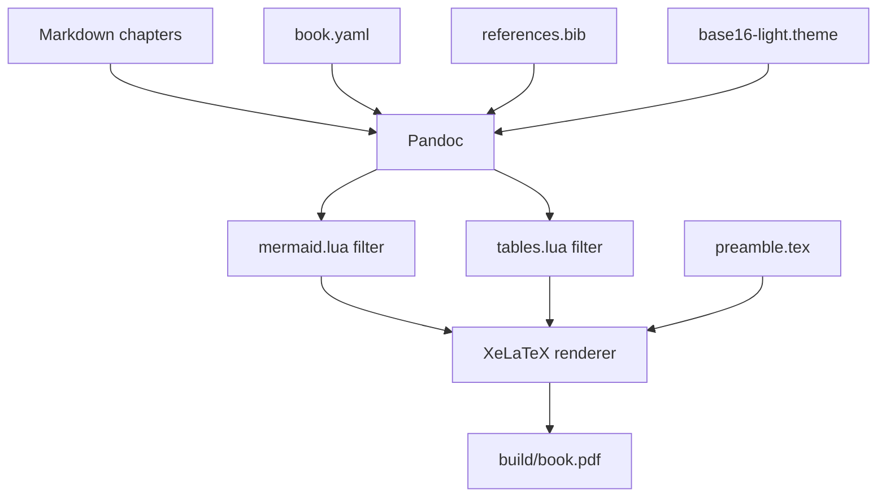

# Building the Book {#sec:building}

The Makefile is the single entry point for all output formats. This chapter covers every target, what it produces, and how to use the excerpt feature.

## Build Targets

| Target | Output | Description |
|---|---|---|
| `make pdf` | `build/book.pdf` | Print-ready PDF via XeLaTeX |
| `make epub` | `build/book.epub` | E-reader EPUB 3 |
| `make html` | `build/book.html` | Single self-contained HTML file |
| `make excerpt` | `build/excerpt-pN-pM.pdf` | Page range extracted from the PDF |
| `make all` | all three formats | PDF + EPUB + HTML in one run |
| `make clean` | *(nothing)* | Deletes `build/` entirely |
| `make install-deps` | *(nothing)* | Prints dependency setup instructions |

## PDF

The recommended build path uses Docker. If a `book-builder` image exists and Docker is running, every `make` target automatically delegates to a transient container — no local XeLaTeX, fonts, or Mermaid CLI required:

```bash
$ make docker-build   # one-time image build (~2 min)
$ make pdf            # runs inside the container
```

The Makefile detects Docker automatically. To force a native build without Docker, pass `USE_DOCKER=0`:

```bash
$ make pdf USE_DOCKER=0
```

Pandoc converts the Markdown chapters to a LaTeX intermediate, applies the Lua filters, includes `preamble.tex`, and passes everything to `xelatex`. The result lands at `build/book.pdf`.

The PDF target is incremental: Make checks timestamps and only rebuilds when a source file is newer than the existing PDF. Modifying a chapter, the preamble, `book.yaml`, or the highlighting theme all trigger a rebuild.

```{=latex}
\begin{tipbox}
To force a full rebuild regardless of timestamps, run
\texttt{make clean \&\& make pdf}. This is useful after changing
\texttt{book.yaml} fields that affect the title page or metadata.
\end{tipbox}
```

## EPUB

```bash
$ make epub
```

Pandoc generates an EPUB 3 file at `build/book.epub`. The EPUB target also runs the Mermaid filter, so diagrams render as embedded PNGs.

To include a cover image, place a file at `assets/cover.png`. The Makefile detects it automatically and passes `--epub-cover-image` to Pandoc. Without a cover file, the build succeeds without one.

## HTML

```bash
$ make html
```

Produces a single self-contained HTML file at `build/book.html`. The `--embed-resources` flag tells Pandoc to inline all images as base64 data URIs and all CSS as `<style>` blocks, so the file is portable — share it without a separate assets folder.

The HTML output uses Pandoc's default HTML template with the Base16 Light highlighting theme. It does not apply the custom preamble (which is LaTeX-only), so callout boxes written as `{=latex}` raw blocks do not appear in the HTML version. See [Chapter 8](#sec:customization) for how to add matching HTML callouts.

## Excerpt

The excerpt target extracts a range of pages from the built PDF using `qpdf`:

```bash
$ make excerpt EXCERPT_START=5 EXCERPT_END=20
Extracting pages 5-20 from build/book.pdf ...
Written: build/excerpt-p5-p20.pdf
```

The output filename encodes the page range, so multiple excerpts coexist in `build/` without overwriting each other.

```{=latex}
\begin{tipbox}
Use excerpts to share a sample chapter with potential readers or reviewers
without revealing the full manuscript. Generate the full PDF first (
\texttt{make pdf}), then extract whatever page range covers the chapter.
\end{tipbox}
```

If `build/book.pdf` does not exist, `make excerpt` builds it first automatically.

## Build Pipeline

The full PDF build pipeline looks like this:



## Watching for Changes

The Makefile does not include a file-watcher target, but you can combine it with any watcher tool. With `fswatch`:

```bash
$ fswatch -o chapters/ book.yaml preamble.tex \
  | xargs -n1 -I{} make pdf
```

Or with `watchexec`:

```bash
$ watchexec --exts md,yaml,tex -- make pdf
```

## Version Control

The `.gitignore` excludes `build/` entirely. Commit only source files:

```bash
$ git add chapters/ assets/ references.bib book.yaml
$ git commit -m "add chapter 3: code listings"
```

Generated outputs (`build/book.pdf`, `build/book.epub`) are reproducible from source, so there is no reason to track them in Git. If you need to distribute a specific build, tag the commit and attach the PDF as a release artifact in your Git host.

```{=latex}
\begin{dangerbox}
Never force-push to a shared branch after your book goes to reviewers.
If a reviewer checks out the tag and runs \texttt{make pdf} to verify a
fix, a force-push changes history under them and invalidates their build.
\end{dangerbox}
```

## CI/CD

For automated builds on every commit, a minimal GitHub Actions workflow:

```yaml
name: Build book

on: [push]

jobs:
  build:
    runs-on: ubuntu-latest
    steps:
      - uses: actions/checkout@v4

      - name: Install Pandoc
        run: |
          wget -q https://github.com/jgm/pandoc/releases/download/3.9/\
          pandoc-3.9-linux-amd64.tar.gz
          tar xzf pandoc-*.tar.gz
          sudo mv pandoc-*/bin/pandoc /usr/local/bin/

      - name: Install TeX Live
        run: sudo apt-get install -y texlive-xetex texlive-fonts-extra

      - name: Install mmdc
        run: npm install -g @mermaid-js/mermaid-cli

      - name: Build PDF
        run: make pdf

      - name: Upload artifact
        uses: actions/upload-artifact@v4
        with:
          name: book-pdf
          path: build/book.pdf
```
